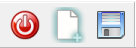
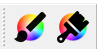
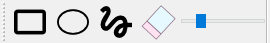
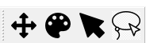
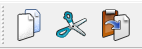
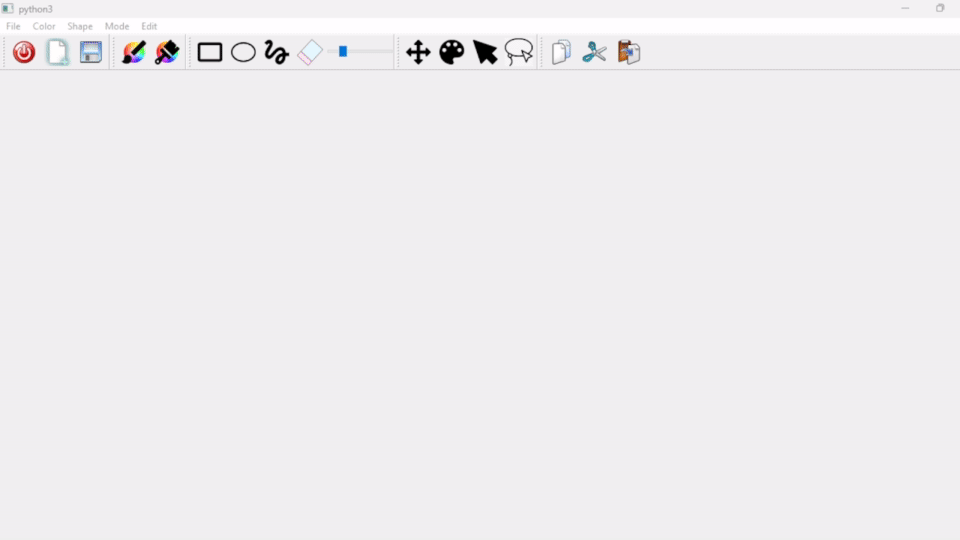

---
# IHM 
## TME 2: Outils de dessin
---
### TARIK EGE EKEN - 21110611
### KAAN DİŞLİ - 21113004
---
---

This project is a graphical drawing application built using **PyQt5**. It provides tools for freehand drawing, shape creation, and object selection/manipulation.

(To view this markdown file with images, please open it in a markdown viewer that supports images, or view it on GitHub)

## Tools and Features
---
- **Quit**: Close the application. Shortcut: `Esc`
- **New File**: Clear the canvas and start a new drawing, also clears the log. Shortcut: `Ctrl + N`
- **Save**: Save the current canvas as an image file, and the current log as a text file in the project directory, the current time will also be added to the file name to avoid overwriting or confusion. Shortcut: `Ctrl + S`

  
---
- **Pen Color Picker**: Choose the color for freehand drawing and shape borders.
- **Fill Color Picker**: Choose the color to fill the shapes.

  
---
- **Shape Tools**: Draw with predefined shapes like rectangles and ellipses. Can customize the fill and border colors.
- **Freehand Drawing**: Create freeform lines with customizable pen colors and brush sizes which can be adjusted using the color picker and the slider in the toolbar.
- **Eraser**: Erase the drawn objects, size can also be adjusted using the slider.
- **Size Adjustment Slider**: Adjust the pen/eraser size using a slider in the toolbar.

  
---
- **Move**: Move selected objects, or deselect objects by clicking on an empty part of the canvas and move the entire canvas, to open more space on the current screen without having to delete existing objects.
- **Draw**: Draw freehand lines, rectangles, ellipses, or erase objects.
- **Single Selection**: Click on objects to select them to edit, move or delete them.
- **Lasso Selection**: Select multiple objects using a lasso tool. Also has special scriboli commands that recognize your gestures and execute commands like move or delete.

  
---
- **Copy**: Copy the selected object(s) to the clipboard.
- **Cut**: Cut the selected object(s) to the clipboard.
- **Paste**: Paste the copied object(s) from the clipboard to the canvas.

  
---

## Scriboli Features

- **Scriboli Delete**: Draw a zigzag pattern over the lasso selection to delete the selected objects.

  
- **Scriboli Move**: Move the lasso in a straight line to move the objects within the lasso selection. The direction of the line determines the direction of the movement using the trigonometric function: the movement vector `(cos(radians(angle)), -sin(radians(angle)))` where `angle` is the angle between the start and end points of the lasso after having circled the objects.

  

## File Structure

- `MainWindow.py`: Manages the main GUI, integrating the canvas and menu bar / tool bar functionalities.
- `Canvas.py`: Handles all the drawing logic, shape rendering, and user interaction on the canvas, including the Scriboli features.
- `icons/`: Directory containing all the icons used in the application interface. Including some custom icons made by us.
- `resources.py`: Resource files managing icons and other assets.
- `README.md`: Project documentation.
- `demos/`: Directory containing demonstration images. Including the ones used above and below.
- `demos/demo.mp4`: A video demonstration of the application in action.
<video src="demos/demo.mp4" width="320" height="240" controls></video>

  (Markdown does not support audio, so to hear my commentary, please download the video and watch it on a normal video player)

- `demos/canvas_example.png`: An example image saved from the application. Made by us to show some of the features.

  <image src="demos/canvas_example.png" width="320" height="240"></image>

